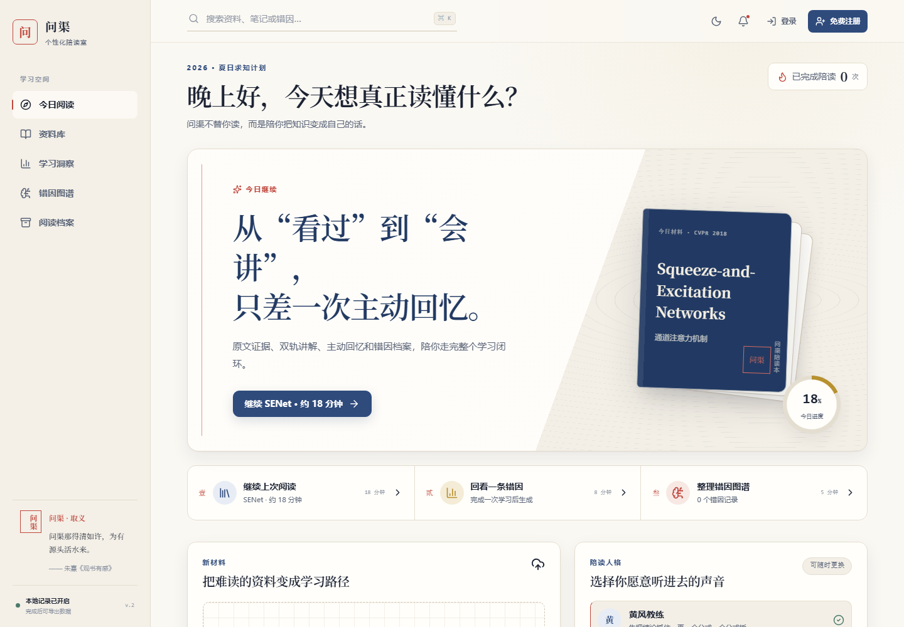
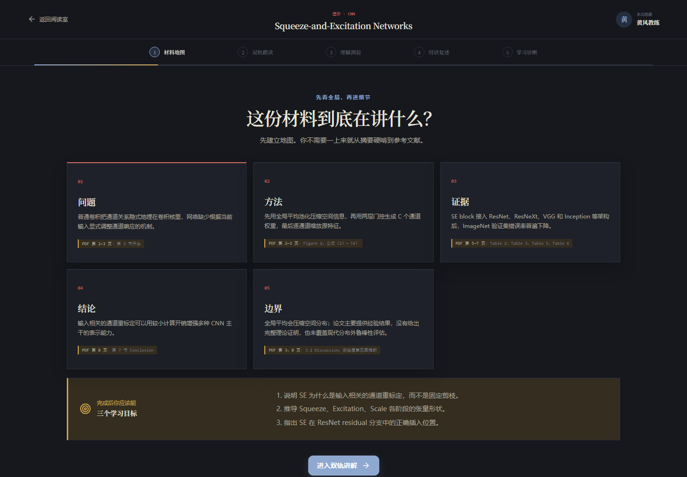
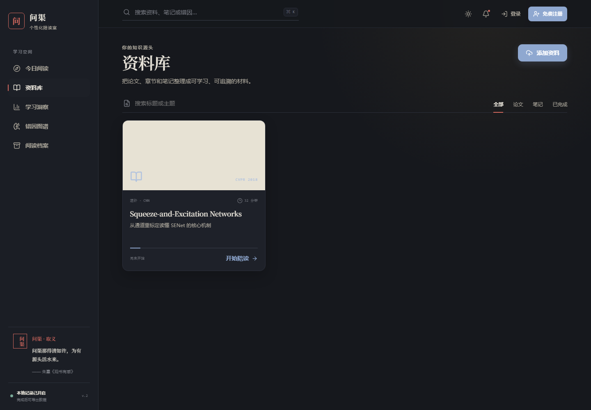
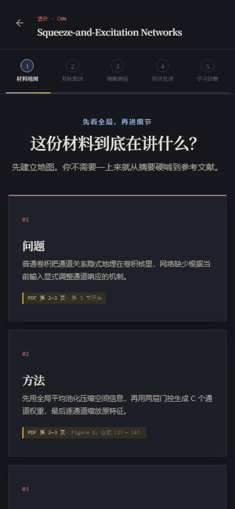

# 问渠 Wenqu

> 问渠不替你读，而是陪你把知识变成自己的话。

[主网站 · 在线体验问渠](https://wenqu-reading-room.vercel.app/) · [自定义入口](https://wenqu.zhuofan.me/) · [GitHub Pages 静态演示](https://lizhuofan-curry.github.io/wenqu/)

[](https://github.com/lizhuofan-curry/wenqu/actions/workflows/ci.yml)




**问渠**取意于朱熹《观书有感》"问渠那得清如许，为有源头活水来"。它是一间强调原文证据的 AI 个性化陪读室，目标不是替学习者生成一段总结，而是陪学习者完成：

```text
材料地图 → 双轨跟读 → 主动回忆 → 用话复述 → 错因诊断 → D1/D3/D7 间隔复习
```

| 维度 | 说明 |
|---|---|
| 适合谁 | 正在读论文、专业课材料或长文档，希望真正复述出来的学习者 |
| 核心差异 | 回答必须回到原文证据；先暴露理解缺口，再给诊断和下一步 |
| 当前版本 | v.5：错因迁移检验、可信延迟保持率、课前诊断与可撤销自适应路线、本地证据笔记卡、服务端可信评分归档 |
| 在线入口 | [主网站](https://wenqu-reading-room.vercel.app/) · [自定义入口](https://wenqu.zhuofan.me/) · [GitHub Pages 静态演示](https://lizhuofan-curry.github.io/wenqu/) |

v.3 "纸上书房"以东方人文色谱与现代学习工作台结合：宣纸暖白/墨色夜读双主题、期刊纸张严格轨、暖色便签陪读轨、稿纸复述、朱砂批注诊断。v.4 在此基础上上线 Vercel 同域 FastAPI、DeepSeek 语义评分、上传材料学习包、冷启动真实性保护与 D1/D3/D7 间隔复习。v.5 继续上线错因迁移检验、可信延迟保持率、课前诊断、可撤销自适应路线和浏览器本地证据笔记卡。登录用户的学习记录由评分接口使用服务端结果直接归档，客户端提交的分数或诊断结构不作为数据库真值。

首份内置材料为 CVPR 2018 论文 *Squeeze-and-Excitation Networks*，支持完整运行的地图、讲解、三道理解题、复述、AI 优先且可回退的规则评分和学习档案。

## 10 秒看懂问渠

| 如果你想... | 问渠会这样做 |
|---|---|
| 快速判断材料讲什么 | 先生成问题、方法、证据、结论和局限组成的材料地图 |
| 不想被 AI 直接喂答案 | 在提交前隐藏标准答案，通过主动回忆暴露真实理解 |
| 知道自己错在哪里 | 用错因标签、逐题反馈和原文定位解释误解来源 |
| 复盘学习过程 | 保存回答、复述、掌握度和下一步建议到阅读档案 |
| 不想学完就忘 | 根据真实学习档案生成 D1/D3/D7 到期任务，复习时先回忆、不回看原文，并比较前后掌握度 |

## 功能截图

| 首页 / 资料库 | 材料地图 / 学习流 |
|---|---|
|  |  |
| 纸上书房首页：今日阅读、资料入口与学习状态 | 材料地图：先建立问题、方法、证据、结论和局限 |

| 资料库 | 移动端学习流 |
|---|---|
|  |  |
| 管理内置材料与上传材料 | 手机端保留双轨阅读和复述流程 |

## 为什么不是另一个 PDF 聊天框

- **先建立地图**：先辨认问题、方法、证据、结论与局限，再进入细节。
- **严格轨 + 陪读轨**：一条负责准确和引用，一条负责把难点讲得愿意听。
- **提交前隐藏答案**：通过主动回忆暴露真实理解缺口。
- **诊断错因，不只给分**：区分空间与通道、sigmoid 与 softmax、瓶颈与输出维度等具体误解。
- **回到原文**：正式反馈带论文页码、公式或结构图位置。
- **留下学习档案**：保存复述、掌握度和误解标签，而不是只留一段聊天记录。
- **按间隔重新想一遍**：从真实档案推导 D1/D3/D7 任务，完成后按来源会话与间隔去重。
- **服务端保存评分真值**：云端记录由后端评分结果构造；账号不一致时拒绝写入，保存失败时保留本地恢复副本。
- **云同步失败可安全恢复**：生产数据库已取消普通登录账号对评分档案的直接写入、修改和删除权限；恢复凭据由独立服务端密钥签名，同一凭据重复提交只落一条档案。
- **换一个情境再验证**：从服务端可信错因生成不重复原题的迁移任务，明确区分已迁移、部分迁移和尚未迁移。

## 当前可用功能

- 东方人文「纸上书房」双主题视觉与响应式布局；
- 响应式洞察布局：三项指标在桌面端等宽铺满，搜索与材料筛选不会挤压换行；诊断路线与证据笔记在 320–390px、明暗主题下支持长中英文和无空格标识符断行，并保持现有宣纸、墨色与朱砂视觉体系；
- 今日阅读、资料库、学习洞察、错因图谱和阅读档案；
- “今日复习”D1/D3/D7 间隔队列：到期任务直接进入主动回忆，结果页显示与上次掌握度和错因的变化；
- Vercel 主站同域 React SPA + FastAPI Python Serverless API；
- GitHub Pages 静态演示模式（`VITE_DEMO_MODE=true`）；
- Supabase 真实邮箱注册、登录、RLS 用户隔离与跨设备学习档案；
- 服务端可信学习归档：登录 token、请求发起账号、材料归属和复习来源均在评分及 AI 配额前校验；客户端不能提交 mastery、headline 或 session_data 作为评分真值；
- 云同步恢复中心已在 Production 上线：普通登录账号只能读取自己的评分档案，云写失败可用服务端签名凭据幂等恢复，重复恢复不会产生重复记录；
- 错因驱动迁移检验已在 Production 上线：只从服务端可信基线生成任务，私有 rubric 不下发浏览器，重复评分返回同一已保存结果；
- 可信延迟保持率基础设施已上线：D1/D3/D7 必须同账号、同来源、同评分版本配对，未到期或样本不足时不展示伪造趋势；
- 已登录用户可先完成独立的 SENet 课前诊断，再选择可停止、恢复或手动覆盖的建议学习路线；诊断不计入正式掌握度；
- 本地证据笔记卡支持搜索、编辑、删除和 JSON/Markdown 导出；来源只是定位快照，笔记不进入评分且首版不跨设备同步；
- 三种陪读人格：黄风教练、安静师姐、严格研究员；
- SENet 材料地图与三个学习目标；
- 严格轨 / 陪读轨双栏阅读；
- 三道开放式理解题与稿纸复述；
- 朱砂批注诊断：得分、错因标签、正式反馈和原文定位；
- 本地学习记录与 JSON 导出；
- PDF / Markdown 上传、文本提取与 AI 学习包生成；
- 上传材料可在首页或资料库确认后永久删除；内置 SENet 学习包受保护，不提供删除操作；
- DeepSeek 结构化语义评分、原文片段选择和失败时的证据规则回退；上传与评分各只发起一次模型请求，避免向量调用阻塞学习流；
- 上传材料会话的冷启动恢复保护：无法确认原材料时明确报错，不会错误套用 SENet 诊断；
- React 19 + TypeScript + Vite 前端，FastAPI + Pydantic 后端。

### 已上线：错因驱动迁移检验

生产迁移 `202608250002_transfer_tasks.sql` 已执行，PR #34 已合并并发布。题目由服务端从当前账号的可信评分档案确定性生成，浏览器拿不到私有 rubric；上传材料会绑定评分规则指纹。付费评分采用 at-most-once 状态机：一旦模型调用结果未知，任务冻结并等待人工核对，不会自动再次调用造成重复计费。旧档案继续保留，但不会自动成为可信迁移来源。

生产验收使用一次性账号完成了可信基线评分、迁移题生成与评分，以及相同请求的重复恢复；数据库只形成一条任务和一条迁移归档。测试账号及数据随后级联清理，生产计数恢复原值。

### 已上线：可信延迟保持率（等待首个真实 D1 样本）

延迟保持率按同一来源会话、同一评分规则与同一题组配对 D1/D3/D7 复习结果，并报告实际间隔、有效样本数与排除项；复述任务不混入该指标，样本不足时不展示伪造的零分或趋势。对应的原子测量占位与防重复约束位于 `202608250003_retention_measurements.sql`。

迁移已严格按 001 → 002 → 003 顺序应用到生产数据库，测量 claim 只能由服务端 RPC 原子创建。生产验收确认新基线带服务端可信标记与评分规则指纹，未到 D1 时不会提前创建 claim。首个真实 D1 保持率仍需等待基线满 24 小时后再测，因此当前不宣称已有保持趋势或学习提升。

### 已上线：课前目标级起点建议与自适应路线

课前诊断首版只面向已登录账号和内置 SENet。系统先单独下发三道不含答案、原文定位或隐藏评分点的盲测题，完成诊断或明确跳过后才加载完整学习材料，避免正式题目和讲解提前污染课前基线。每题把握程度只随回答记录，不参与评分；结果不是能力测评，也不计入正式掌握度。

结果只给出目标级证据状态和建议学习顺序，不展示标准答案或分数。建议可以撤销、改选，可以从头开始，也可以继续阅读全部章节，不会强制跳过内容。私有迁移 `202608250004_diagnostic_attempts.sql` 已应用，PR #36 与 #37 已合并发布；生产验收确认 prepare 幂等、重复评分返回同一结果、重新读取仍为 completed，且隐藏规则不进入公开题目载荷。

自适应路线 MVP 进一步把建议落实为当前会话内的可操作导航：保留建议顺序，允许显式停止、恢复或手动覆盖；学习者可逐节选择“已理解”或“仍需复核”，有待复核章节时先经过可逐项查看和移除的检查点，再进入测验。路线、理解标记和复核清单不持久化，不写入正式评分或学习档案，也不使用 confidence、停留时间或关键词推断理解。该交互只帮助组织本次浏览顺序，不证明路线造成了学习效果提升。

### 已上线：本地证据笔记卡

学习者可以在材料地图、双轨阅读和学习诊断结果的来源定位旁，保存“我的理解”或“待核对”两类笔记。来源信息只是创建时的定位快照，不代表内容已经被论文核验；卡片也不会进入评分、掌握度、保持率或学习档案。闭卷测验、复述和延迟复习阶段不提供笔记入口，避免破坏主动回忆。

首版笔记只保存在当前浏览器，并按登录账号或匿名空间隔离；匿名笔记不会在登录后自动归属账号，也不会跨设备云同步。集中面板支持搜索、编辑、删除、复制 Markdown，以及导出 JSON 或 Markdown 备份；原材料删除与原位置可能变化会分别提示，不把二者混为一类。PR [#38](https://github.com/lizhuofan-curry/wenqu/pull/38) 已合并并发布，生产构件已核验包含创建入口、集中面板、两种导出和永久删除确认。


## 在线演示

| 地址 | 说明 |
|---|---|
| https://wenqu-reading-room.vercel.app/ | **主网站**：生产 API、上传材料、AI 评分、D1/D3/D7 复习与跨设备档案 |
| https://wenqu.zhuofan.me/ | **自定义入口**：与主网站指向同一 Vercel Production，已配置独立自动续期 HTTPS 证书 |
| https://lizhuofan-curry.github.io/wenqu/ | GitHub Pages 静态演示：仅内置演示学习流 |

主网站使用同域生产 API；DeepSeek 密钥仅保存在 Vercel 服务端环境变量，绝不进入浏览器或仓库。GitHub Pages 是静态演示，不承诺上传与在线评分。未配置 Supabase 时，账号与记录保存在当前浏览器；配置后自动升级为真实邮箱账号和跨设备档案。

## 项目结构

```text
apps/web/                    React + TypeScript 前端
services/api/                FastAPI、评分、AI 与 SQLite
supabase/migrations/         云端账号与学习记录数据库迁移
scripts/                     跨平台开发脚本
docs/product/                产品架构、设计文档与原型
docs/research/senet/         SENet 证据与学习包
docs/progress/               版本进展与复盘
docs/workflow/               自动化工作流
resources/papers/            本地论文，不提交 Git
.github/workflows/           CI 自动审查
```

更完整的目录说明见 [docs/STRUCTURE.md](docs/STRUCTURE.md)。

## 本地运行

### 1. 准备环境

- Node.js 22+
- pnpm 11+
- Python 3.12+

### 2. 安装依赖

```powershell
pnpm install
python -m venv services/api/.venv
node scripts/py.mjs -m pip install -r services/api/requirements-dev.txt
```

### 3. 配置 AI（上传自定义材料时需要）

```powershell
Copy-Item .env.example .env.local
```

推荐使用 DeepSeek：

```dotenv
AI_PROVIDER=deepseek
DEEPSEEK_API_KEY=
DEEPSEEK_MODEL=deepseek-v4-flash
```

也可以把 `AI_PROVIDER` 改为 `openai` 并设置 `OPENAI_API_KEY`。密钥只由后端读取，
不会进入浏览器或 Git；内置 SENet 学习流程不需要模型密钥。

云同步失败恢复还需要单独的服务端签名密钥：

```dotenv
ARCHIVE_RETRY_SECRET=
```

该值只用于签发和校验不可篡改的恢复凭据，必须是至少 32 个 UTF-8 字节的独立随机值，不能使用 Supabase service role key 代替，也不能进入浏览器或 Git。

### 浏览器数据说明

- 未登录或云端不可用时，昵称、答案、复述和诊断保存在当前浏览器的账号命名空间；
- 密码不会保存在浏览器或问渠后端，由 Supabase Auth 直接处理；
- 完成学习后可在"阅读档案"下载 JSON 数据备份；
- 未配置 Supabase 时，清理浏览器网站数据或更换设备后，本地记录不会自动同步；
- 配置 `VITE_SUPABASE_URL` 与 `VITE_SUPABASE_ANON_KEY` 后，登录用户的记录会自动跨设备同步；
- 浏览器只使用 Supabase 公开 anon key，数据由 RLS 按用户身份隔离。
- 生产评分完成后，后端只用服务端材料、回答、复述与规范化评分结果构造云端档案；数据库写入失败时页面会明确保留本地副本，不会假报同步成功。
- 配置恢复签名密钥后，登录用户可从首页或阅读档案重试失败的云端归档；重试只提交服务端签名凭据，不重新评分，也不再次消耗 AI 配额。
- 本机副本依赖当前浏览器存储，清理网站数据、更换浏览器或使用隐私模式可能使其丢失；请在恢复完成前按需导出 JSON 备份。

### 4. 启动

```powershell
pnpm dev
```

- 前端：http://localhost:5173
- API 文档：http://localhost:8000/docs

## 自动审查

每次推送和 Pull Request 都会运行：

- 前端 TypeScript 类型检查；
- 前端生产构建；
- 后端 Ruff 静态检查；
- FastAPI 接口与完整 SENet 学习闭环测试。

本地执行同一套检查：

```powershell
pnpm check
```

CI 不调用 OpenAI 或 DeepSeek API，也不需要仓库密钥。

## 产品与开发文档

- [v.0 产品架构](docs/product/architecture.md)
- [v.0 产品设计](docs/product/design.md)
- [v.3 纸上书房改版方案](docs/product/REDESIGN-PROPOSAL-v2.md)
- [v.4 真实评分与上传材料上线](docs/progress/v.4.md)
- [当前进展与下一步](docs/progress/current.md)
- [踩坑与复盘](docs/progress/lessons-learned.md)
- [内容生产自动化工作流](docs/workflow/content-workflow.md)
- [DeepSeek 接入与数据边界](docs/deployment/deepseek.md)
- [Supabase 真实账号与跨设备记录](docs/deployment/supabase.md)

## 路线图

- **v.0**：跑通 SENet 的可验证陪读闭环；
- **v.1**：蓝白品牌双主题、资料库/洞察/错因图谱、公开演示模式；
- **v.2**：Supabase 真实账号、RLS 用户隔离、跨设备学习档案；
- **v.3**：纸上书房双主题视觉、沉浸学习流、样式模块化拆分；
- **v.4**：Vercel 同域后端、DeepSeek 评分、原文片段选择、上传材料学习包与冷启动真实性保护；
- **v.4 当前增量**：D1/D3/D7 间隔复习、前后掌握度对比、服务端可信归档与多账号竞态保护；
- **v.5 当前增量**：云同步恢复中心、错因驱动迁移检验、可信延迟保持率、课前目标级起点建议、可撤销自适应路线和本地证据笔记卡均已合并并发布；首个真实 D1 保持率需等待基线满 24 小时后验收；
- **后续学习效果路线**：真实课前/课后异题验证、证据笔记云端同步的独立安全设计、语音复述与多材料专题。

## 设计参考

产品模式参考了 [PageLM](https://github.com/CaviraOSS/PageLM)、[Study Buddy](https://github.com/michaelborck-education/study-buddy)、[Kotaemon](https://github.com/Cinnamon/kotaemon)、[DeepTutor](https://github.com/HKUDS/DeepTutor) 与 [OpenDataLoader PDF](https://github.com/opendataloader-project/opendataloader-pdf)。本项目只借鉴公开产品与架构模式，不复制不明许可的实现代码。

---

问渠 v.5 已完成 002–004 生产迁移，并依次合并、发布 PR #34–#38。错因迁移与课前诊断均完成可清理的一次性账号真实闭环；可信延迟保持率已建立安全测量基础设施，但首个真实 D1 样本仍需等待满 24 小时，当前不宣称已有保持趋势或因果提升。
