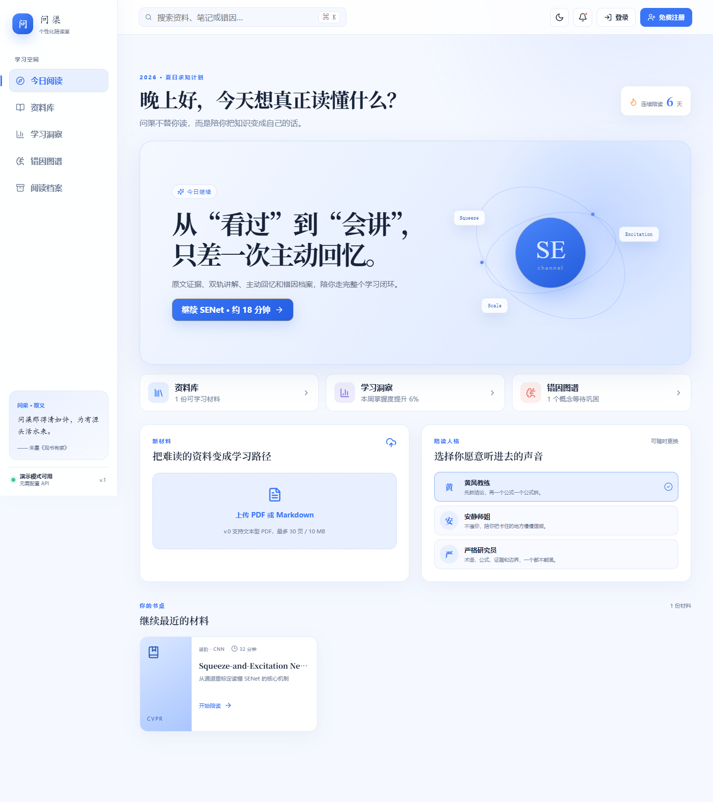

# 问渠 Wenqu

> 问渠不替你读，而是陪你把知识变成自己的话。

[](https://github.com/lizhuofan-curry/zhiyu-study-room/actions/workflows/ci.yml)




**问渠**取意于朱熹《观书有感》“问渠那得清如许，为有源头活水来”。它是一间强调原文证据的 AI 陪读阅读室，不止概括材料，而是带学习者完成一条完整闭环：

```text
材料地图 → 双轨跟读 → 主动回忆 → 用话复述 → 错因诊断 → 阅读档案
```

v.0 以 CVPR 2018 论文 *Squeeze-and-Excitation Networks* 为首份内置材料。即使没有调用模型，SENet 的地图、讲解、三道理解题、复述、规则评分和学习档案也可以完整运行。

## 为什么不是另一个 PDF 聊天框

- **先建立地图**：先辨认问题、方法、证据、结论与局限，再进入细节。
- **严格轨 + 陪读轨**：一条负责准确和引用，一条负责把难点讲得愿意听。
- **提交前隐藏答案**：通过主动回忆暴露真实理解缺口。
- **诊断错因，不只给分**：区分空间与通道、sigmoid 与 softmax、瓶颈与输出维度等具体误解。
- **回到原文**：正式反馈带论文页码、公式或结构图位置。
- **留下学习档案**：保存复述、掌握度和误解标签，而不是只留一段聊天记录。

## 当前可用功能

- 蓝白主题、白天 / 夜间模式与响应式导航；
- 今日阅读、资料库、学习洞察、错因图谱和阅读档案；
- 可公开访问的无后端演示模式；
- 前端注册 / 登录演示与浏览器本地账户；
- 三种陪读人格：黄风教练、安静师姐、严格研究员；
- SENet 材料地图与三个学习目标；
- 严格轨 / 陪读轨双栏阅读；
- 三道开放式理解题与 3—5 句复述；
- 可重复的 SENet 证据规则评分；
- 得分、错因标签、正式反馈和原文定位；
- 本地 SQLite 阅读档案；
- PDF / Markdown 上传与 AI 学习包生成；
- 响应式 React 界面与 FastAPI REST API。

## 项目结构

```text
apps/web/                    React + TypeScript 前端
services/api/                FastAPI、评分、AI 与 SQLite
docs/product/                产品架构与交互设计
docs/research/senet/         SENet 证据与学习包
docs/progress/               版本进展与下一步
docs/workflow/               自动化工作流
resources/papers/            本地论文，不提交 Git
.github/workflows/           CI 自动审查
```

更完整的目录说明见 [docs/STRUCTURE.md](docs/STRUCTURE.md)。

## 本地运行

### 1. 准备环境

- Node.js 22+
- pnpm 11+
- Python 3.12+

### 2. 安装依赖

```powershell
pnpm install
python -m venv services/api/.venv
services/api/.venv/Scripts/python.exe -m pip install -r services/api/requirements-dev.txt
```

### 3. 配置 AI（上传自定义材料时需要）

```powershell
Copy-Item .env.example .env.local
```

在 `.env.local` 中设置 `OPENAI_API_KEY`。密钥只由后端读取；内置 SENet 学习流程不需要密钥。
上传自定义材料还需要对应 OpenAI API 项目拥有可用额度。

### 4. 启动

```powershell
pnpm dev
```

- 前端：<http://localhost:5173>
- API 文档：<http://localhost:8000/docs>

## 自动审查

每次推送和 Pull Request 都会运行：

- 前端 TypeScript 类型检查；
- 前端生产构建；
- 后端 Ruff 静态检查；
- FastAPI 接口与完整 SENet 学习闭环测试。

本地执行同一套检查：

```powershell
pnpm check
```

CI 不调用 OpenAI API，也不需要仓库密钥。

## 产品与开发文档

- [v.0 产品架构](docs/product/architecture.md)
- [v.0 产品设计](docs/product/design.md)
- [v.0 验证范围](docs/product/v0-validation.md)
- [v.0 项目进度](docs/progress/v.0.md)
- [当前进展与下一步](docs/progress/current.md)
- [内容生产自动化工作流](docs/workflow/content-workflow.md)

## 路线图

- **v.0**：跑通 SENet 的可验证陪读闭环；
- **v.1**：增强真实 PDF 解析、引用定位、任务队列与费用控制；
- **v.2**：用户系统、跨材料错因档案与数据删除；
- **v.3**：封闭测试、隐私合规、监控与可恢复部署；
- **v.4**：移动端封装、商店素材、备案与上架候选版。

## 设计参考

产品模式参考了 [PageLM](https://github.com/CaviraOSS/PageLM)、[Study Buddy](https://github.com/michaelborck-education/study-buddy)、[Kotaemon](https://github.com/Cinnamon/kotaemon)、[DeepTutor](https://github.com/HKUDS/DeepTutor) 与 [OpenDataLoader PDF](https://github.com/opendataloader-project/opendataloader-pdf)。本项目只借鉴公开产品与架构模式，不复制不明许可的实现代码。

---

知隅仍处于 v.0。现在最重要的不是“生成更多内容”，而是验证学习者能否真正完成阅读、答题、复述，并认可系统指出的误解。
